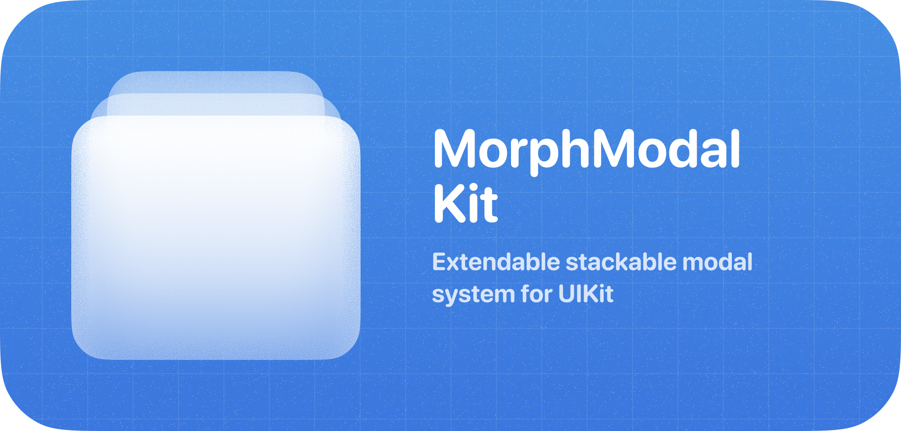

<p align="center">
  
</p>

MorphModalKit is a lightweight, flexible UIKit package for building card-stack modals with smooth “morph” (replace) animations and support for sticky elements. It provides a blank-canvas container—feel free to use your own views and components.

---

## 🚀 Installation

### Swift Package Manager

1. In Xcode, choose **File ▶ Add Packages…**  
2. Enter this URL:  
   ```
   https://github.com/jsmmth/MorphModalKit.git
   ```  
3. Click **Add Package**, select your target(s), and finish.

### Package.swift

If you manage dependencies via a manifest:

```swift
// swift-tools-version:5.9
import PackageDescription

let package = Package(
  name: "MyApp",
  platforms: [.iOS(.v15)],
  dependencies: [
    .package(url: "https://github.com/jsmmth/MorphModalKit.git", from: "0.0.1"),
  ],
  targets: [
    .target(
      name: "MyApp",
      dependencies: [
        .product(name: "MorphModalKit", package: "MorphModalKit")
      ]
    )
  ]
)
```

Then in your code:

```swift
import MorphModalKit
```

---

## 🎨 Core Concepts

### ModalView

Conform your `UIViewController` to `ModalView`:

```swift
public protocol ModalView: UIViewController {
  /// Desired height for a given container width
  func preferredHeight(for width: CGFloat) -> CGFloat

  /// Whether the modal can be dismissed by swipe or tapping overlay
  var canDismiss: Bool { get }

  /// If returning a UIScrollView, its top-bounce gesture will dismiss the modal
  var dismissalHandlingScrollView: UIScrollView? { get }

  // Optional lifecycle hooks
  func modalWillAppear()
  func modalDidAppear()
  func modalWillDisappear()
  func modalDidDisappear()
}
```

**Minimal example:**

```swift
class ExampleModal: UIViewController, ModalView {
  override func viewDidLoad() {
    super.viewDidLoad()
    // Build your UI…
  }
  func preferredHeight(for _: CGFloat) -> CGFloat { 320 }
}
```

> **Tip:** The container will never exceed the device height; it adapts when the keyboard appears. Wrap content in a scroll view and return it in `dismissalHandlingScrollView` to enable pull-to-dismiss from the scroll gesture.

---

## 📱 Presenting & Navigation

All presentation APIs live on any `UIViewController` once you import MorphModalKit.

### Presenting

```swift
presentModal(
  ExampleModal(),
  options: ModalOptions.default,
  sticky: StickyElementsContainer.Type? = nil,
  animated: true,
  showsOverlay: true
)
```

- **`sticky`**: supply a subclass of `StickyElementsContainer` to render persistent UI during morph (replace) animations.
- **`options`**: adjust layout, shadows, animation springs, and more (see Configuration below).

### Pushing & Popping

Within a `ModalView`, you can retrieve the host controller:

```swift
modalVC?.push(AnotherModal(), sticky: MySticky.self)
modalVC?.pop()        // back to previous card
modalVC?.hide()       // dismiss the entire stack
```

> **Tip**: Use this extension to find the current `ModalViewController` from anywhere else:

```swift
extension UIViewController {
  var modalVC: ModalViewController? {
    sequence(first: parent) { $0?.parent }
      .first(where: { $0 is ModalViewController })
      as? ModalViewController
  }
}
```

### Replace (Morph)

Swap the content of the top card without moving the card itself:

```swift
modalVC?.replace(
  with: NextModal(),
  direction: .forward, // or .backward
  animation: .scale // or .slide(100)
)
```

- **`.scale`** (default): fades between views, scaling from 95–105%.
- **`.slide(px)`**: both incoming and outgoing views slide horizontally by `px`.

---

## 📌 StickyElementsContainer

Use a `StickyElementsContainer` subclass to overlay persistent UI (e.g., headers, footers, navigation bars) across replace animations.

```swift
class MySticky: StickyElementsContainer {
  required init(modalVC: ModalViewController) {
    super.init(modalVC: modalVC)
    // add subviews & constraints…
  }
  required init?(coder: NSCoder) { fatalError() }

  override func contextDidChange(
    to newOwner: ModalView,
    from oldOwner: ModalView?,
    animated: Bool
  ) {
    // update state when the modal content changes
  }
}
```

Pass your sticky class to `present(…, sticky:)` or `push(…, sticky:)`.

> **Tip**: See [Examples/UIKitExample/Modals/StickyElements.swift](./Examples/UIKitExample/UIKitExample/Modals/StickyElements.swift) for an example of how I have used this in the example.

> **Note:** Interaction events “fall through” the container except on its interactive subviews.

---

## ⚙️ Configuration

Customize every aspect via `ModalOptions`:

| Property                   | What it does                                             | Default                           |
|----------------------------|----------------------------------------------------------|-----------------------------------|
| `horizontalInset`          | Side margins of each card                                | `10`                              |
| `bottomSpacing`            | Space from bottom (nil = safe area + 10)                 | `nil`                             |
| `stackVerticalSpacing`     | Gap between stacked cards                                | `20`                              |
| `keyboardSpacing`          | Gap between the bottom of the card and the keyboard      | `10`                              |
| `cornerRadius`             | Card corner radius                                       | `32`                              |
| `cornerMask`               | Card corner mask                                         | `[.layerMinXMinYCorner, .layerMaxXMinYCorner, .layerMinXMaxYCorner, .layerMaxXMaxYCorner]` |
| `maxVisibleStack`          | How many cards peek behind the front card                | `2`                               |
| `dimBackgroundColor`       | Color of background cards                                | `.black`                          |
| `dimOpacityMultiplier`     | Darkness of background cards                             | `0.06`                            |
| `overlayColor`             | Overlay backdrop color                                   | `.black`                          |
| `overlayOpacity`           | Overlay backdrop opacity                                 | `0.2`                             |
| `modalBackgroundColor`     | Base card background                                     | `.secondarySystemGroupedBackground` |
| `animation`                | Spring settings for present/push/pop                     | `(0.4, damping:0.86, velocity:0.8)` |
| `morphAnimation`           | Spring settings for replace (morph)                      | `(0.4, damping:0.95, velocity:1)` |
| `cardShadow`               | Card shadow `(color, opacity, radius, offset)`           | `(.black, 0.12, 9, (0,2))`        |
| `usesSnapshots`            | Snapshot offscreen cards for performance                 | `true`                            |
| `usesSnapshotsForMorph`    | Snapshot during morph replacements                       | `false`                           |
| `showsHandle`              | Show drag-handle when dismissable                        | `true`                            |
| `handleColor`              | Color of the drag-handle                                 | `.tertiarySystemGroupedBackground` |
| `enableGlass`              | Enables liquid glass background effect (iOS 26 only)     | `false`                           |

**Example: Full-width, bottom-pinned modal**

```swift
var opts = ModalOptions.default
opts.horizontalInset = 0
opts.bottomSpacing = 0
opts.cornerMask = [.layerMinXMinYCorner, .layerMaxXMinYCorner]

presentModal(MyModal(), options: opts, sticky: MySticky.self)
```

---

## 🔍 Tips & Tricks

- **Performance**: Background cards snapshot themselves for smooth animations. Disable via `options.usesSnapshots = false`.
- **Keyboard Avoidance**: The stack re-layouts on keyboard frame changes, maintaining `keyboardSpacing`.
- **Scroll-to-Dismiss**: Return your scroll view in `dismissalHandlingScrollView`, helpful when wrapping content in a `UIScrollView` or subclass.
- **Disable Dismissal**: Override `var canDismiss: Bool { false }` in your `ModalView` You'll still be able to programatically call `.pop`'.

---

## 🛠 Example Project

See [Examples/UIKitExample/Modals](./Examples/UIKitExample/UIKitExample/Modals) for a working demo using only the package’s APIs. Feel free to swap in your own UI—this example is just a starting point.

Happy morphing! 🚀
